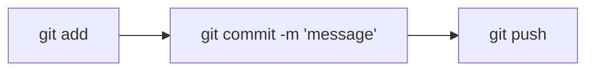

# Git Cheatsheet
## Installing Git
[[OpenSuse]] -> `zypper install git`
[[Debian]] -> `apt install git`
[[Arch Linux]] -> `pacman -Syyu git`
### Git (Version Control System)
- **Initialize a Git repository**: `git init`
- **Clone a remote repository**: `git clone <repository-url>`
### Configuration
- **Configure Git user name**: `git config --global user.name "Your Name"`
- **Configure Git user email**: `git config --global user.email "your@email.com"`
### Basic Workflow

- **Add changes to the staging area**: `git add <file>`
- **Commit changes**: `git commit -m "Your commit message"`
- **Push changes to a remote repository**: `git push`
### Status and Logs
- **Check the status of your repository**: `git status`
- **View commit history**: `git log`
### Branches
- **List branches**: `git branch`
- **Create a new branch**: `git branch <branch-name>`
- **Switch to a branch**: `git checkout <branch-name>`
- **Create and switch to a new branch**: `git checkout -b <branch-name>`
- **Merge a branch into the current branch**: `git merge <branch-name>`
- **Delete a branch**: `git branch -d <branch-name>`
### Remote Repositories
- **Show remote repositories**: `git remote -v`
- **Add a remote repository**: `git remote add <name> <repository-url>`
- **Pull changes from a remote repository**: `git pull`
### Undoing Changes
- **Discard changes in a file**: `git checkout <file>`
- **Unstage changes**: `git reset <file>`
- **Undo the last commit, keeping changes**: `git reset --soft HEAD~1`
- **Undo the last commit and discard changes**: `git reset --hard HEAD~1`
### Tagging
- **Create an annotated tag**: `git tag -a <tag-name> -m "Tag message"`
- **List tags**: `git tag`
- **Push tags to a remote repository**: `git push --tags`
### Ignoring Files
- **Create a .gitignore file**: `touch .gitignore`
- **Specify files and patterns to ignore in .gitignore**

#git #coding #commands #linux #sysops #mermaidjs